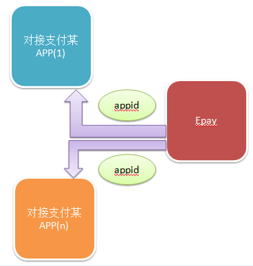

# epay

# epay是一个标准的支付平台，作为支付应用APP、第三方支付平台、身份系统三方对接的标准中间服务器。提供注册应用APP，创建用户订单，用户支付跳转，用户支付结果跳转与通知等功能。开发者只需关心1个创建订单接口、1个支付跳转url、1个支付结果回跳url、1个支付结果通知url即可。

## 此项目问题反馈与答疑QQ群：537982451
	
	
## 流程图1（注册app流程图）

## 流程图2（支付流程图）

## 项目目录结构：

### EpayServer（目录结构 4144行）

	|--src.main.java（服务器代码）
		|--EpayServer.properties---------------配置文件（需要修改）
		|--generatorConfig.xml--------------------mybatis自动生成配置文件（重新生成时，需要修改）
		|--org.epay
			|--action.IdentityAction.java---------从第三方身份系统获取数据（对接非默认身份系统时，需要修改）
			|--server.Expand.java-------------------扩展启动类
			|--plugin.PaginationPlugin.java-------mybatis自动生成配置文件启动类
			|--http
				|--AlipayNotifyServlet.java-------支付宝异步通知接收类
				|--AlipayReturnServlet.java-------支付宝同步通知接收类
			
		|--com.alipay-----------------------------支付宝调用包（整合了MD5与RSA，通过配置可选）
	|--protobuf（消息包生成工具）
	|--WebContent
		|--*.html（请求接口测试）
		|--js（请求接口测试）
		|--html（请求接口测试）

## 打版本：在项目根目录下，执行

	ant

	
## 如何使用epay

### 1、配置并部署epay

